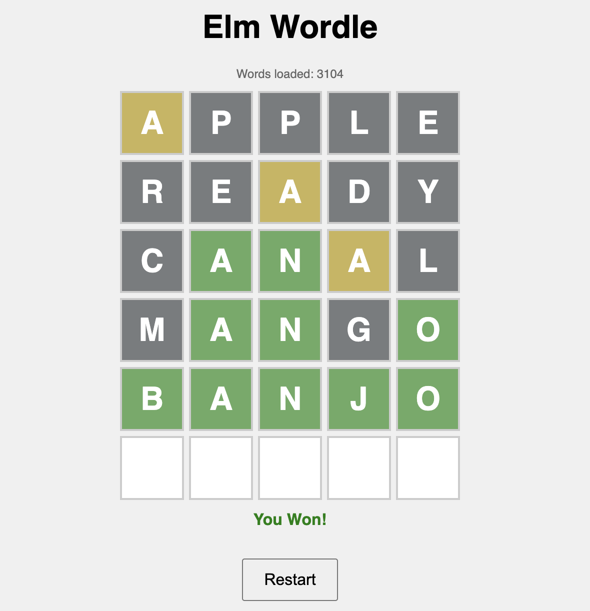
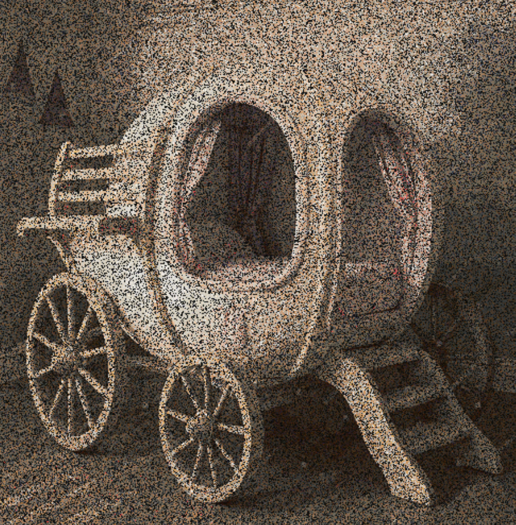

# Portfolio Projects – JavaScript, Elm, and Go

This repository gathers three academic software projects built in different ecosystems.
It is designed as a portfolio showcase for a CV, with a focus on game logic, functional UI development, and parallel image processing.

## Repository Overview

- **JS/**: Terminal card game implementation in modern JavaScript.
- **projet-elm/**: Wordle-style game built in Elm.
- **projet-go/GO/**: Go image-processing experiments (sequential vs parallel), plus client/server mode.
- **Ressources/**: Visual assets used in this portfolio README.

## 1) Flip 7 CLI – JavaScript

### Project Summary
`Flip 7 CLI` is a command-line implementation of a multiplayer card game.
Players draw cards turn by turn, decide whether to continue or stop, manage action cards, and accumulate score until a winner reaches the target.

### What this project demonstrates
- Object-oriented game architecture (`Game`, `Round`, `Deck`, `Player`).
- Turn-based game loop and player interaction in terminal.
- Input validation and resilient CLI prompts.
- Structured game logging in JSON for replay/analysis.

### Setup & Run
#### Prerequisites
- Node.js 18+ (or newer LTS).
- npm.

#### Installation
```bash
cd JS
npm install
```

#### Launch
```bash
npm start
```

#### Output
- Runtime logs are saved under `JS/logs/`.

---

## 2) Elm Wordle – Functional Frontend

### Project Summary
`Elm Wordle` is a browser-based clone of Wordle, implemented in Elm.
It applies functional architecture (model-update-view) and deterministic state transitions for a clean, maintainable game loop.



### What this project demonstrates
- Functional frontend development in Elm 0.19.
- Unidirectional data flow and typed state management.
- Clean browser UI behavior with no JavaScript framework dependency.

### Setup & Run
#### Prerequisites
- Elm 0.19.1.
- Python 3 (for local static server).

#### Installation / Build
```bash
cd projet-elm
elm make src/Main.elm --output=main.js
```

#### Run locally
```bash
python -m http.server
```

Open: `http://localhost:8000`

---

## 3) Go Image Processing – Sequential vs Parallel

### Project Summary
This Go project compares sequential and parallel implementations for image processing pipelines.
It includes grayscale transformation, downscaling, and pixel remapping, with performance-oriented experimentation.



### What this project demonstrates
- Concurrency and parallel processing in Go.
- Performance comparison methodology (sequential vs parallel).
- Matrix-based pixel transformations and output generation.
- Optional client/server architecture over TCP for remote processing.

### Setup & Run
#### Prerequisites
- Go (version compatible with the modules in `projet-go/GO`).

### Option A – Local demo pipeline
```bash
cd projet-go/GO/demo-project
go mod tidy
go run .
```

Generated outputs are written in `projet-go/GO/demo-project/output/`.

### Option B – Client/Server execution
Start server:
```bash
cd projet-go/GO/server
go mod tidy
go run .
```

In another terminal, start client:
```bash
cd projet-go/GO/client
go mod tidy
go run .
```

The client asks for:
- Server IP address
- Input image path
- Processing mode (BW / downscale / remap)

Result image is saved in `projet-go/GO/client/output/out.jpg`.

---

## Skills Highlighted

- **Programming languages**: JavaScript, Elm, Go.
- **Software design**: modular architecture, separation of concerns, reusable components.
- **Concurrency**: goroutines and multi-core processing strategies.
- **Tooling & execution**: CLI workflows, local servers, module/package management.

## Author

Portfolio repository prepared for CV and GitHub presentation.
